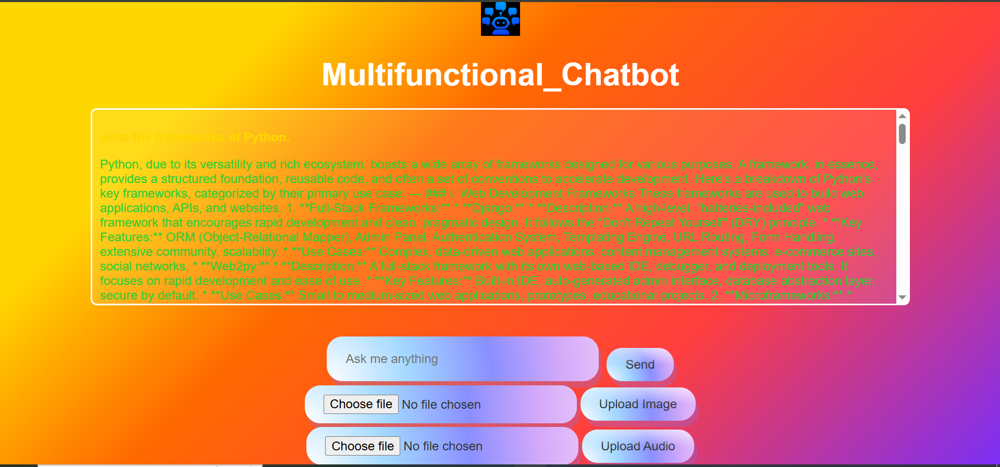

# 👾 Flask Web Application with Google Gemini API and Speech Recognition (Multifunctional-Chatbot)


<p> This is a Flask-based web application that integrates multiple functionalities, including text generation via the Google Gemini API, image analysis, and speech recognition. It provides a simple interface to upload images, interact with the chatbot, and even engage in voice-based interactions.</p>


## 📦Libraries and Frameworks Used

### Libraries and Frameworks:
- **Flask**: A lightweight Python web framework for building web applications.

- **Google Gemini API** – Used for generating text-based responses and analyzing images.

- **Pillow (PIL)** – A Python Imaging Library used for image processing.

- **SpeechRecognition** – Handles speech-to-text conversion for voice commands.

- **pyaudio** – A library used for audio input, required for speech recognition.

- **python-dotenv** – Loads environment variables from a .env file to securely store sensitive data like API keys.

- **werkzeug** – A utility library used for secure filename handling during file uploads.

## Explanation of the Code.

### 1️⃣ Loading Environment Variables

<p>I used <mark>python-dotenv</mark> to securely load the API key from a <mark>.env</mark> file. This helps keep sensitive information like the API key out of the codebase.</p>

```javascript
Python

 load_dotenv()
```

### 2️⃣ Flask Web Application Setup

<p>I initialized a Flask web server using the Flask class and configure the upload folder for storing images.</p>

```javascript
python

app = Flask(__name__)
UPLOAD_FOLDER = 'static/uploads'
app.config['UPLOAD_FOLDER'] = UPLOAD_FOLDER
```
### 3️⃣ Google Gemini API Initialization

I used the <bold>Google Gemini API</bold> client to communicate with the Gemini model. The API key, stored in the <mark>.env</mark> file, is retrieved using <mark>os.getenv()</mark>.

```javascript
Python

client = genai.Client(api_key=api_key)
```

### 4️⃣ Speech Recognition Setup

The **SpeechRecognition** library is used to recognize speech from the microphone, convert it into text, and generate a response from the Gemini model.

```javascript
Python

r = sr.Recognizer()
```

### 5️⃣ Home Route (Main Page)

When a user visits the root URL (/), the app renders the main page (index.html), showing the chat history.

```javascript
python

@app.route('/')
def home():
    return render_template('index.html', history=history)
```

### 6️⃣ Text Generation Route (/generate)

This route listens for a POST request with user-provided text content. It sends the content to the Google Gemini model and stores the resulting response in the history list, which is later displayed on the UI.

```javascript
python

@app.route('/generate', methods=['POST'])
def generate_content():
    content = request.form.get('content')
    response = client.models.generate_content(model="gemini-2.5-flash", contents=content)
    history.append({'type': 'text', 'input': content, 'response': response.text})
    return jsonify({'text': response.text})
```

### 7️⃣ Image Upload and Analysis Route (/upload)

Users can upload images via a **POST** request. The uploaded image is saved and analyzed using the **Google Gemini model**, which provides a text description of the image. The result is displayed on the webpage along with the uploaded image.

```javascript
python

@app.route('/upload', methods=['POST'])
def upload_image():
    image = request.files['image']
    filename = secure_filename(image.filename)
    filepath = os.path.join(app.config['UPLOAD_FOLDER'], filename)
    image.save(filepath)

    image_pil = Image.open(filepath)
    try:
        response = client.models.generate_content(model="gemini-2.5-flash", contents=[image_pil, "Tell me about this image."])
        analysis_text = response.text
    except Exception as e:
        analysis_text = f"Error during analysis: {str(e)}"

    history.append({'type': 'image', 'input': filename, 'response': analysis_text})
    return render_template('index.html', history=history, image_url=filename, analysis=analysis_text)
```

### 8️⃣ Voice Recognition and Response Route (/listen)

This route allows users to speak to the application, and it will recognize the speech and convert it to text. Then, the converted text is sent to the Gemini model for processing. The response is returned as a chatbot reply.

```javascript
python

@app.route('/listen', methods=['POST'])
def listen():
    with sr.Microphone() as source:
        r.adjust_for_ambient_noise(source, duration=1)
        r.pause_threshold = 1
        print("Listening...")

        try:
            audio = r.listen(source, timeout=5, phrase_time_limit=10)
            query = r.recognize_google(audio, language="en-in")
            print(f"You said: {query}")
            response = client.models.generate_content(model="gemini-2.5-flash", contents=query)
            history.append({'type': 'voice', 'input': query, 'response': response.text})
            return jsonify({'text': response.text})
        except Exception as e:
            return jsonify({'text': "Sorry, I couldn't understand the audio. Please try again."})
```


### 9️⃣ Running the Application

The Flask app runs on debug mode, allowing automatic reloading during development.

```javascript
python

if __name__ == '__main__':
    app.run(debug=True)
```

<h3>Features in Action:</h3>

<h4>🔊Voice Interaction:</h4>
You can speak to the app, and it will recognize your speech and respond with a generated response using **Google Gemini API.**

<h4>📷 Image Upload & Analysis:</h4>
You can upload images and get an analysis of the image via **Google Gemini API.**

<h4>💬 Text Chat:</h4>
You can interact with the app using a simple text-based chat interface.


<h4>Conclusion</h4>
This Flask app integrates cutting-edge functionalities such as **speech recognition** , **image analysis** , and **text generation** using **Google Gemini API.** It provides a seamless experience for users to interact with the application using multiple modes — voice, text, and images.


<h5>Summary:</h5>

🛠 **Libraries:** Flask, Google Gemini API, Pillow (PIL), SpeechRecognition, pyaudio

💬 **Features:** Chatbot (text), Image analysis, Voice interaction

📲 **User Input:** Text, Image Upload, Voice

🔄 **Output:** Generated text, Image description, Speech response


## 💡 2- HTML Template (index1.html)
* Display the uploaded image.
* Show the analysis result received from the chatbot.


## 3- How It Works:
* The user uploads an image via the form.

* The image is saved in the static/uploads folder on the server.

* The uploaded image is opened using the Python Imaging Library (PIL).

* The image is passed to the Gemini AI model via the client.models.generate_content API call for analysis.

* The analysis result (text) returned by the AI is displayed on the web page alongside the uploaded image.


### Image Here 🖼️


